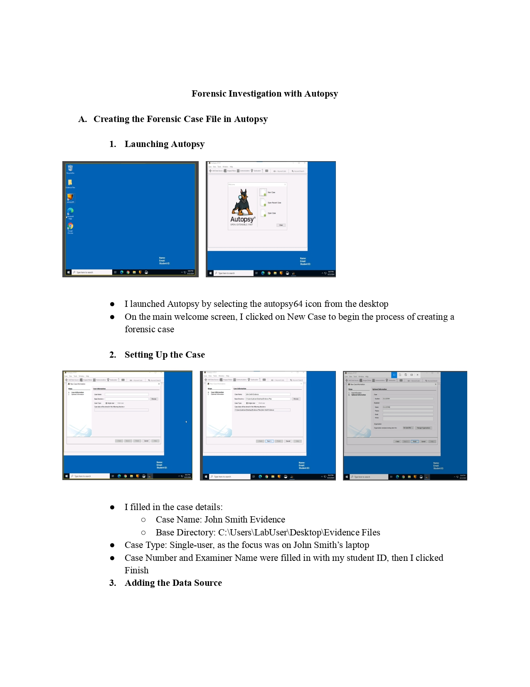
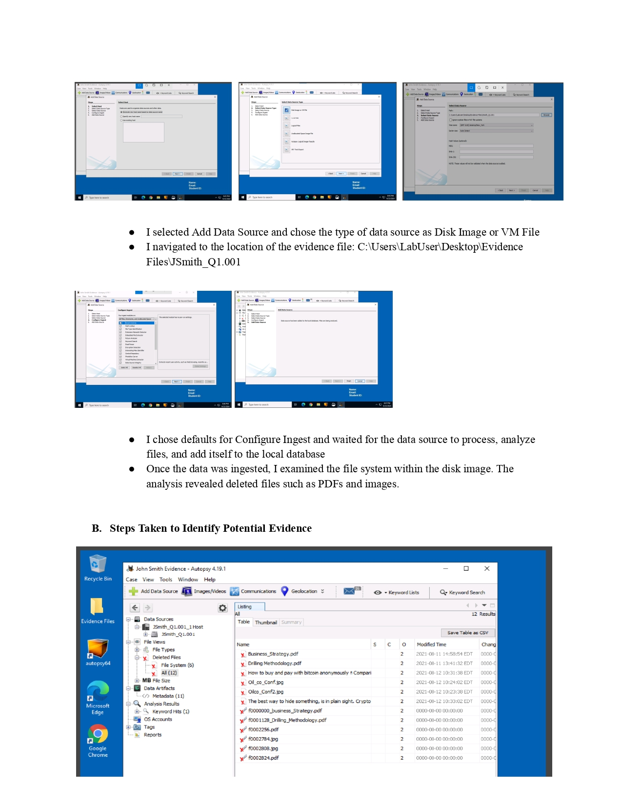
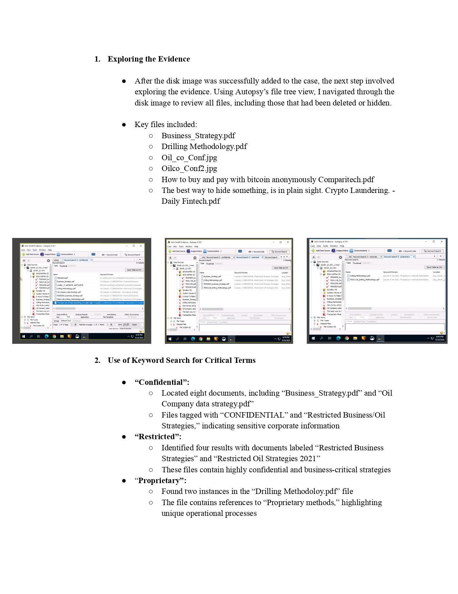
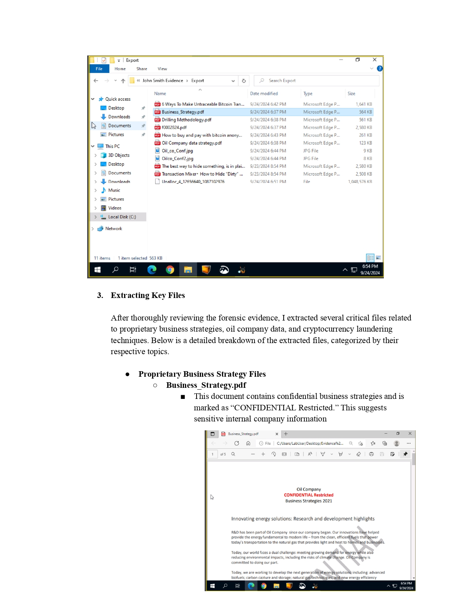
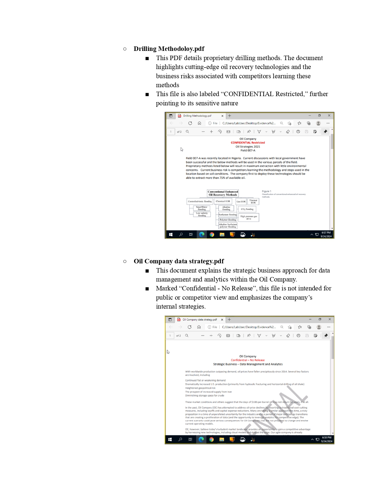
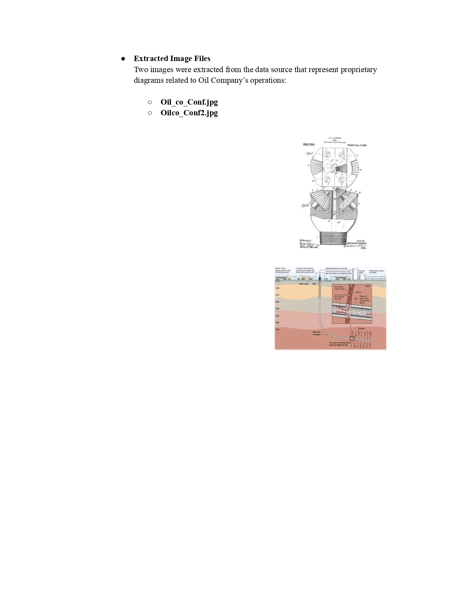
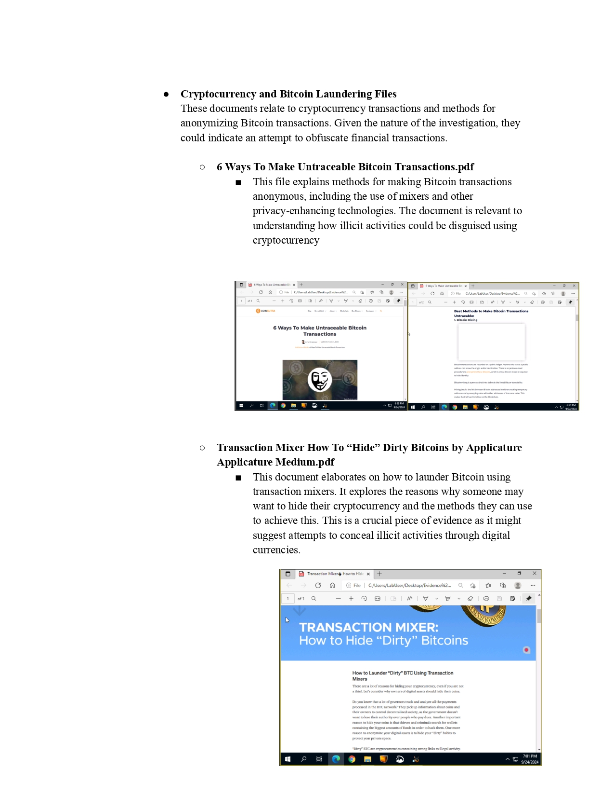
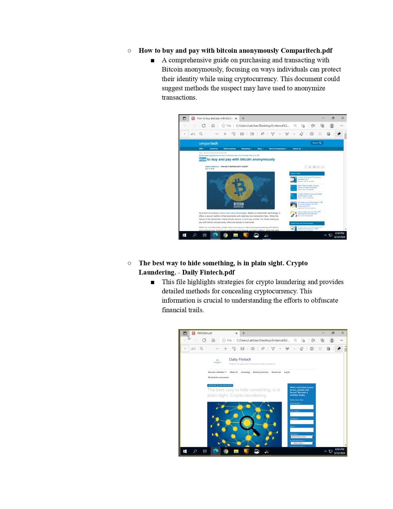
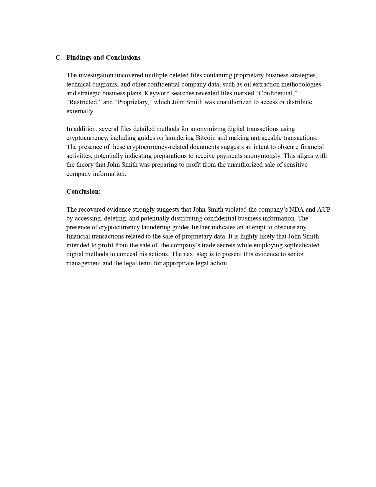

# Digital Forensics Project Report

## Summary
This project involved using Autopsy to conduct a forensic investigation of a disk image. The analysis uncovered deleted files containing confidential business information, such as strategic plans, proprietary drilling methods, and cryptocurrency laundering techniques. Key findings indicated unauthorized access and potential distribution of sensitive data, as well as an intent to anonymize financial transactions. Below are the pages detailing the forensic investigation process and findings.

